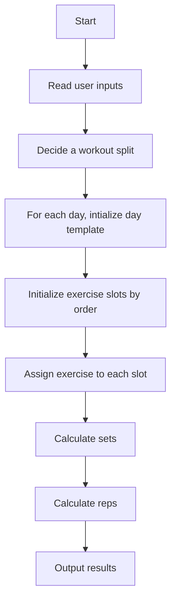

# expert-system

COMP 474/COMP 6721 Expert System project

## Team Pham-Tran

Members:

- Hoang Thuan Pham
- Minh Huy Tran

## Design

### User inputs

- Goal: Strength or Hypertrophy or Endurance
- Frequency: 3,4,5,6
- Weakpoint: Chest, Back, Shoulder, Legs, None
- Exercise type preference: Free weight, Machine

### Output

The exepected output is a workout routine recommendation with:

- [ ] A workout routine name
- [ ] For each days in the routine, output the exercises
- [ ] For each exercises, output the name, target rep range and number of sets

### Planning

#### Report

- [ ] Clean up and finalize reports
- [x] Add references

#### Design 

- [ ] Complete design for full body

#### Implementations

- [ ] Ensure the code supports debugging
- [x] Read user input
- [x] Define templates for objects (exercises, muscle groups, etc.)
- [ ] Implement routine selection (full body, upper lower, ppl) based on: Frequency
- [ ] Implement initilization of days in a routine (focus, day name, etc.)
- [ ] Implement exercise order based on muscle groups and user weakpoint (exercises slots)
- [ ] Implement exercise selection based on assigned muscle group
- [ ] Calculate number of sets per exercise
- [ ] Calculate number of reps per exercise
- [ ] Output the results

#### Other 

- [ ] Clean up GitHub markdown

##### Logical flow

See `design/rules/workout-split.txt`. For now start with `upper-lower`.



##### Sample result

```
Routine: Upper-Lower
Upper 1: 
    Dumbell bench press (3 sets x 12 reps)
    Lat pull down (3 sets x 12 reps)
    ...
Lower 1:
    Squats (3 sets x 12 reps)
    ...
```